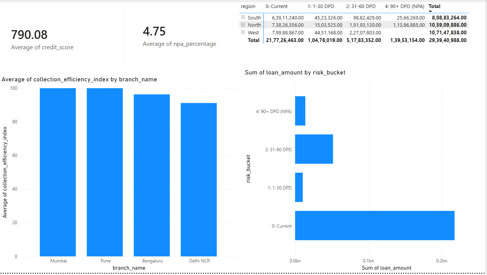
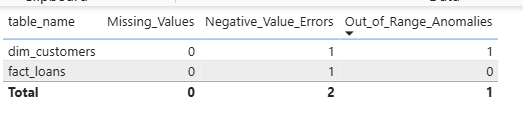

# FinSight: Loan Portfolio Analytics & BI Platform

FinSight is an end-to-end data engineering and business intelligence platform designed to transform raw, multi-branch retail lending records into high-impact operational insights. The system architecture models real-world corporate banking challenges—specifically focusing on asset risk containment, collection efficiencies, and revenue optimization.

## Repository Architecture & File Structure

The project follows a clean, decoupled production repository layout to separate data processing, database management, and visualization layers:

```text
finsight-loan-analytics/
├── database/
│   ├── schema.sql           # Star Schema Relational Table Architecture
│   └── analytical_views.sql # Advanced SQL Business Logic & KPI Framework
├── pipelines/
│   └── seed_data.py         # Python Transaction Simulation Engine
├── run_pipeline.py          # Master Infrastructure Automation Orchestrator
├── bi_dashboard/
│   └── FinSight_Executive_Dashboard.pbix # Interactive Power BI Dashboard
└── README.md                # Technical Portfolio Case Study

```

---

## Data Architecture (Star Schema)

The core data warehouse is designed using a professional **Star Schema** optimized for high-speed analytical querying, minimizing processing overhead on operational systems:

* **Fact Tables:**
* `fact_loans`: Stores baseline lending contract structures (Home Loans, Loan Against Property, Business Loans) and active Assets Under Management (AUM) records.
* `fact_repayments`: Logs granular monthly transaction behavior, expected dues, actual collections, and repayment delays.


* **Dimension Tables:**
* `dim_customers`: Tracks critical borrower profiles including credit scores, income tiers, and relationship vintage metrics.
* `dim_branches`: Maps geographic operational nodes across core regional metros (Mumbai, Delhi NCR, Pune, Bengaluru).


---

## Core Analytical Features & Business Logic

The intellectual heart of the platform resides in the database layer. Complex financial matrices are computed via optimized **SQL Views** to maintain low-latency rendering in the presentation tier:

1. **Portfolio Risk Framework (`view_portfolio_risk`):** Dynamically evaluates historical transaction delays to group loan structures into standardized **Days Past Due (DPD)** buckets, automatically isolating distressed assets crossing the 90-day threshold as **Non-Performing Assets (NPAs)**.
2. **Executive KPI Scorecard (`view_executive_summary`):** Combines core performance metrics into a singular **Composite Portfolio Health Score** out of 100 using a custom weighted banking algorithm ($40\%$ Collection Efficiency Index, $40\%$ NPA containment, and $20\%$ baseline credit risk profiling).
3. **Product Profitability & Branch Rankings (`view_branch_product_profitability`):** Computes simulated interest revenue yields alongside localized collection indexes, applying window functions (`DENSE_RANK()`) to isolate operational performance trends across regions.
4. **Strategic Recommendation Feed (`view_business_insights_actions`):** A deterministic analytics engine that automatically evaluates metrics and generates prescriptive actions (e.g., flagging collection workforce deployment for underperforming nodes or increasing marketing allocations for high-performing ones).
5. **Data Governance & Integrity Guard (`view_data_quality_audit`):** An active data quality tracker that continually scans structural fields for missing records, out-of-range parameters, or date synchronization anomalies (such as negative income profiles or forward-dated transactions).
6. **Cross-Sell Propensity Engine (`view_cross_sell_opportunities`):** Automatically profiles low-risk, high-vintage, flawless-repayment prospects to output pre-qualified pipelines for high-yield secondary banking products.

---

## Execution & Automation

The platform includes a centralized orchestration module (`run_pipeline.py`) written in Python. Executing a single terminal command fully automates the environment initialization, schema deployment, and transaction simulation:

```bash
python run_pipeline.py

```

### **Pipeline Execution Lifecycle:**

1. Establishes a secure connection handshake with the local database instance.
2. Executes `database/schema.sql` to drop old records and re-build the Star Schema infrastructure.
3. Compiles `database/analytical_views.sql` to instantiate the entire computational business logic layer.
4. Invokes the `pipelines/seed_data.py` processing module via a subprocess shell to ingest simulated customer matrices, diverse account risk profiles, and active historical transaction cycles.

---

## Interactive BI Dashboard Walkthrough

The presentation layer (`bi_dashboard/FinSight_Executive_Dashboard.pbix`) translates backend database calculations into a dynamic, two-page executive control center:

### **Page 1: Executive Summary & Decision Center**

* **Portfolio Health Banner:** High-level corporate scorecard displaying Total AUM, Gross NPA %, and the weighted Portfolio Health Score using data-driven metric cards.
* **Hierarchical Regional Matrix:** A structural grid grouping performance metrics by macro territories, enabling senior executives to dynamically drill down from broad geographic views into localized city branch nodes.
* **Collection Efficiency Tracking:** A visual clustered column chart exposing individual branch recovery capabilities against expected baseline targets.
* **Prescriptive Action Engine:** A direct visual table output displaying the automated database strategic recommendations for immediate executive planning.

### **Page 2: Data Governance Audit**

* A dedicated dashboard displaying current data quality checks, summarizing data point exceptions, field integrity levels, and active system validation states to guarantee compliance-ready reporting precision.

## Dashboard Interface Preview

### Executive Summary Screen


### Data Governance Screen


```

```